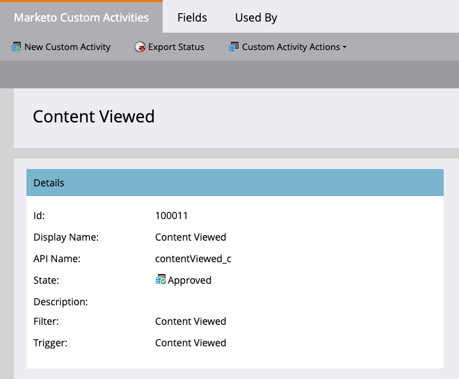
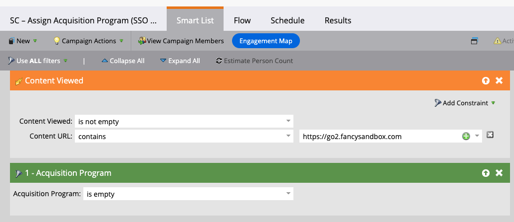
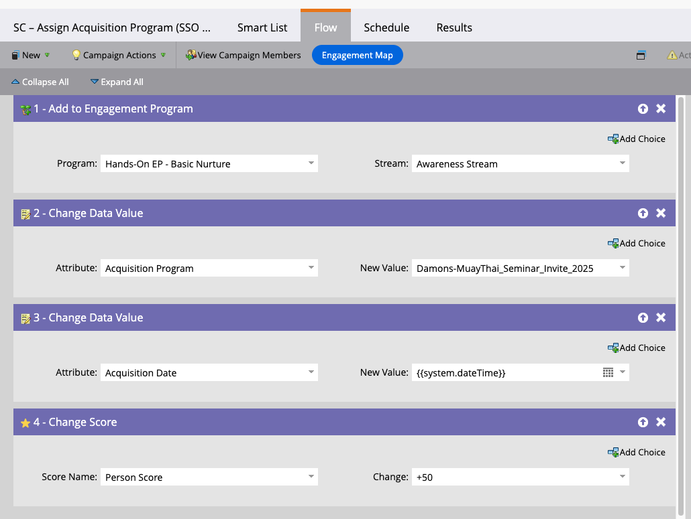

# Track SSO-gated content engagement in Marketo using Custom Activities and REST

This tutorial explains how to track **SSO-authenticated content engagement** in Marketo Engage when access is controlled by an external identity provider such as Okta.  

This process does not use Marketo forms. Identity is handled entirely by SSO, and engagement is written back to Marketo using **Custom Activities** and the **REST API**.

---

## Why this tutorial exists and who it is for

This tutorial is for:

- Marketo Engage administrators
- Technical marketing operations teams
- Identity and platform engineering teams

It applies to organizations that:

- Use SSO for authentication
- Want to gate content **after login instead of with Marketo forms**
- Still require:
  - Acquisition attribution
  - Engagement tracking
  - Lead scoring
  - Smart Campaign automation

---

## Use case

A visitor logs in through SSO and accesses protected content such as reports or PDFs.  

After authentication:

1. The user is identified by email from the identity provider.
2. Marketo is checked for that person.
3. If the person does not exist, the record is created.
4. A **Custom Activity** is appended for:
   - Page view
   - PDF download
5. A Smart Campaign assigns:
   - Acquisition Program
   - Acquisition Date
   - Engagement Program membership
   - Lead score

This model assumes all SSO users are valid Marketo contacts. If a user exists in SSO but not in Marketo, they are created automatically.

---

## Step 1: Create the Custom Activity in Marketo

1. Go to **Admin -> Database Management -> Custom Activities**.
2. Create a new Custom Activity.
   - **Name:** Content Viewed  
3. Create the following fields:
   - **Content Title**
     - API Name: `contentTitle`
     - Type: String
   - **Content URL**
     - API Name: `contentURL`
     - Type: String
4. Approve the Custom Activity.
5. Copy and save the **Activity Type ID**. This ID is required for writing activity through the REST API.

---

## Step 2: (Optional) Create identity support fields

If your organization requires direct correlation with the identity provider:

1. Go to **Admin > Field Management**.
2. Create a person field:
   - **Field Name:** SSO User ID
   - **API Name:** ssoUserId
   - **Type:** String

This field is optional but recommended for identity reconciliation.

---

## Step 3: Store all downloadable assets in one Design Studio folder

For scalable asset tracking:

1. Create a folder in **Design Studio > Files and Images**.
2. Store **all SSO-gated PDFs in this folder only**.

This enables:

- One REST query to dynamically list all downloadable content
- No hard-coded file IDs
- Marketing-controlled asset rotation without engineering changes

Each download will later be recorded as a Custom Activity.

---

## Step 4: High-level REST processing flow (concept only)

This describes the logical flow only. You can implement this in any language or framework.

1. Authenticate to Marketo using client credentials.
2. Retrieve the authenticated user’s email from SSO.
3. Lookup the person in Marketo by email.
4. If the person does not exist:
   - Create the person.
5. Append the **SSO Content View** Custom Activity to the person.
6. Return control to the user to view or download the asset.

At this point, Marketo receives the activity exactly like any native activity.

---

## Step 5: Append the Custom Activity to the person record

For every gated page view or PDF download:

- One Custom Activity record is written.
- The activity contains:
  - Content Title
  - Content URL
- Short deduplication logic should be applied to prevent artificial spikes from refreshes.

This activity becomes the single trigger source for all downstream automation.

---

## Step 6: Create the Smart Campaign to assign Acquisition Program

### Smart List configuration

1. Create a new Smart Campaign.
2. In the **Smart List** tab:
   - Add filter **Content Viewed** (your Custom Activity).
   - Set:
     - Content Viewed: is not empty
     - Content URL: contains your SSO domain
   - Add filter:
     - **Acquisition Program is empty**

This guarantees **first-touch attribution only**.

---

## Step 7: Configure the Flow for attribution, nurture, and scoring

Add the following Flow steps in this exact order:

1. **Add to Engagement Program**
   - Program: Hands-On EP – Basic Nurture
   - Stream: Awareness

2. **Change Data Value**
   - Field: Acquisition Program
   - Value: Your campaign or asset program name

3. **Change Data Value**
   - Field: Acquisition Date
   - Value: `{{system.dateTime}}`

4. **Change Score**
   - Score: Person Score +50

---

## Step 8: Execution order in Marketo (as shown in Activity Log)

When a user downloads a gated asset for the first time, the following sequence occurs in one execution pass:

1. New Person (if the record does not yet exist)
2. Content Viewed (Custom Activity)
3. Add to Engagement Program
4. Change Program Status → Member
5. Change Engagement Program Status → Normal
6. Change Data Value → Acquisition Program
7. Change Score → Person Score +50

This order confirms:
- Identity creation
- Engagement tracking
- Attribution
- Nurture enrollment
- Scoring

are all tied to the **same SSO event**.

---

## Step 9: Identity and access rules

This model enforces the following identity behavior:

- If a user exists in SSO but not in Marketo:
  - Marketo creates the record automatically.
- If the user exists in both:
  - The record is updated and activity is appended.
- If the user does not exist in SSO:
  - They never reach Marketo.
- Marketo remains the **system of engagement**, not the identity authority.

---

## Step 10: Video demonstration

[!VIDEO](assets/sso-post-login-tracking.mov)

---

## Summary

This process enables:

- SSO-only gated content
- Real-time activity tracking in Marketo
- Automated Acquisition Program assignment
- Lead scoring and nurture enrollment
- Dynamic PDF asset management
- Zero Marketo form dependency

Marketo remains the system of engagement and attribution while SSO remains the system of identity.